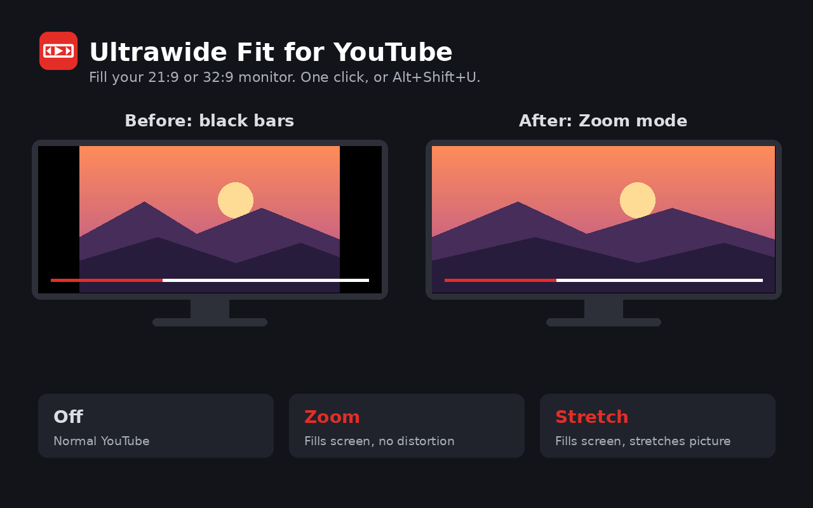

# Ultrawide Fit for YouTube

A Chrome extension that makes YouTube videos fill ultrawide (21:9 and 32:9) monitors instead of showing black bars down the sides.



## Modes

Click the toolbar icon or press **Alt+Shift+U** to cycle between:

- **Off**: normal YouTube.
- **Zoom**: fills the screen without distortion, trimming a little from the top and bottom. Ideal for 21:9 films uploaded with black bars.
- **Stretch**: fills the screen by stretching the picture.

The icon badge shows the active mode, and your choice is remembered. The shortcut can be changed at `chrome://extensions/shortcuts`.

## Install from source

1. Clone or download this repo.
2. Open `chrome://extensions` and turn on **Developer mode**.
3. Click **Load unpacked** and select the repo folder.

## Privacy

The extension collects no data. It only changes the CSS of the YouTube video player, and your mode setting is stored locally by Chrome.

## Building a store package

```sh
zip -r ultrawide-fit-store.zip manifest.json background.js content.js icons
```

## Disclaimer

This is an independent project and is not affiliated with or endorsed by YouTube or Google.

## License

MIT, see [LICENSE](LICENSE).
